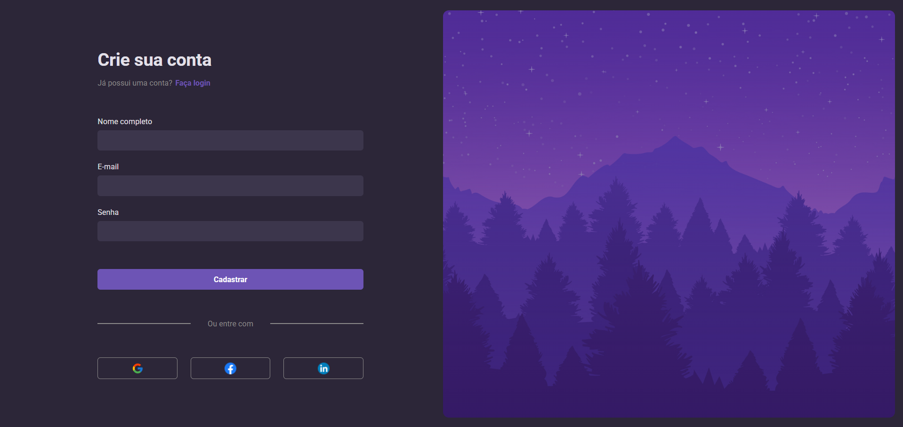

# Desktop Login Form

Este é um projeto simples de formulário de login e cadastro construído com HTML, CSS e JavaScript. O projeto oferece uma interface elegante para que os usuários possam se cadastrar ou fazer login utilizando suas credenciais.

Link de acesso: [Desktop Login Form](https://github.com/emilaynerodrigues/Desktop-Login-Form/)

## Funcionalidades Principais

1. **Formulário de Cadastro:** Permite ao usuário criar uma nova conta, inserindo seu nome, e-mail e senha.
2. **Formulário de Login:** Usuários registrados podem fazer login usando suas credenciais de e-mail e senha.
3. **Opções de login social:** O formulário oferece opções para login via Google, Facebook e LinkedIn.
4. **Transições suaves:** O conteúdo do formulário se ajusta dinamicamente, com animações de transição para criar uma experiência de usuário mais fluida.

## Tecnologias Utilizadas

- **HTML**: Estruturação e marcação do conteúdo.
- **CSS**: Estilização para uma apresentação visual atraente.
- **JavaScript**: Funções de controle para transições entre as seções de login e cadastro.
- 
## Demonstração

